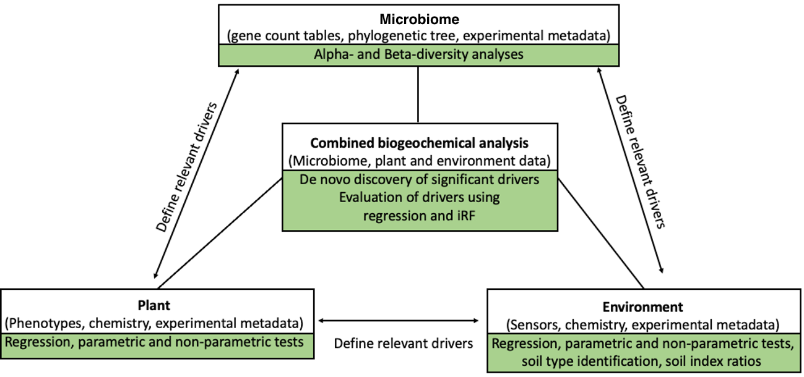

<h1> <b>EcoPLOT Operating Instructions</b></h1>

<H2><b>Overview</b></H2>

EcoPLOT was developed to faciliate the exploration and study of multivariate, biogeochemical datasets. EcoPLOT is organized into three modules (Environmental Data, Phenotype Data, and Amplicon Data), each featuring a variety of statistical and graphical tools unique to each data type. Additionally, EcoPLOT allows users to perform machine learning in the form the iterative Random Forest. This feature promotes the generation of novel hypotheses and can guide future directions of study.   Below we explain how to properly format your data for upload into EcoPLOT and highlight some of the unique features of our tool. For module specific instructions, please consult the guides at the beginning of each section.  

  

  
<H2><b> Formatting Your Data For Upload  </b></H2>
EcoPLOT currently accepts **.csv** , **.tsv**, and **.xlsx** file formats.  
  
The Amplicon Data module accepts **.biom** and **.qza** file formats in addition to those previously mentioned.  

The first column of each file uploaded to EcoPLOT should have the first column reserved for unique sample ID's (see below). This requirement does not apply to tables in **.biom** or **.qza** formats. These file formats should not be altered from their original formats.  
  
Example datasets are included in each module.  
  

  

  

  
  
<H2><b> Logging Information </b></H2>
  
  Each time EcoPLOT is launched, a log file is created that captures important input parameters and results that are encountered over the course of your session. The title of the file consists of a timestamp taken at the begining of your session followed by the word EcoPLOT, i.e.  **timestamp_EcoPLOT.log**.  
  
Logged steps can also be viewed in the R studio console window.  
  

<H2><b> Merging Data </b></H2>
  

Data uploaded to each module can be merged with that in other sections using the <b> Merge Files </b> button.  
  
Merging of the datasets will occur based on the <b>SampleID</b> column. Rows with matching SampleID's will be aligned together following the merge.   
  
  

  
  
<H2><b> Citations</H2></b>
EcoPLOT utilizes many functions from the Phyloseq package in R. We greatly appreciate their work and would like to recognize their contributions. 
  
McMurdie and Holmes (2013) phyloseq: An R Package for Reproducible Interactive Analysis and Graphics of Microbiome Census Data. PLoS ONE. 8(4):e61217
  
  
<H2><b> Contact</H2></b>
The most recent version of EcoPLOT can be accessed via [gitHub](https://github.com/cdsanchez18/EcoPLOT).   

For Questions Please Contact:  
    **EcoPLOT Development Team**  
    ecoplot@lbl.gov  
