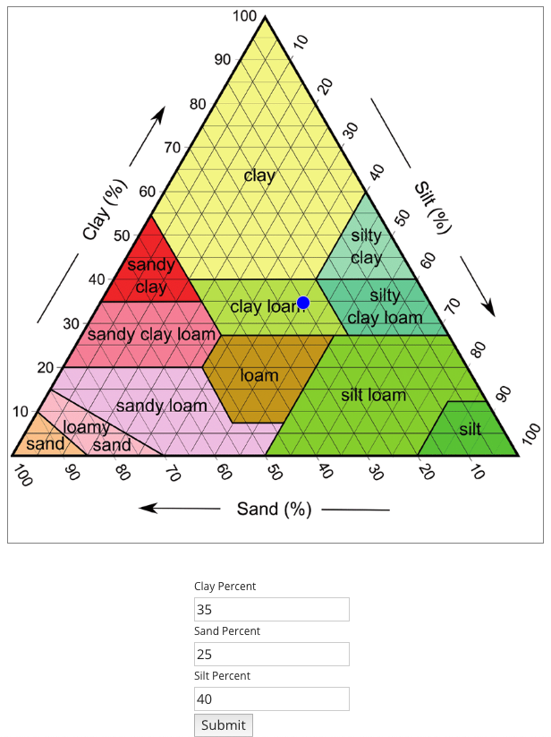
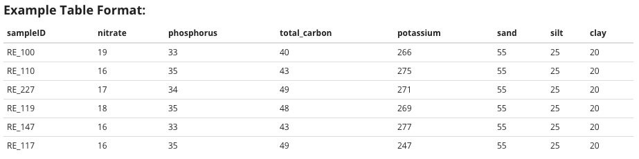

<h1><b> Environmental Data</b></h1>  
The following guide explains how to operate within the Environmental Data module of EcoPLOT. Here we explain the capabilities unique to this module.
  
  
  <h2><b>What is Environmental Data?</b></h2>  
  
  Environmental data includes everything collected over the course of an experiment that measures the physical or chemical properties of an ecosystem. This includes, but is not limited to, <i>in situ</i> measurements capturing atmsopheric conditions (climate), chemical composition, or physical environmental changes over a defined period.  
    
  EcoPLOT is equipped to handle quantitative or qualitative data containing continuous or categorical variables.  
    
  <h2><b>CNP Ratios </b></h2>  
    
  Stoichiometric ratios, like the **CNP** (carbon, nitrogen, phosphorus) and **NPK** (nitrogen, phosphorus, potassium), are commonly used as indicators of soil health and microbial activity. The availability or absence of these nutrients directly influences plant growth and influences microbial community composition and activity. Understanding what these ratios are in your soil can provide insight into the ecosystem dynamics of your community of study.  
  
  <h2><b>Interactive Soil Texture Triangle</b></h2>  
  
  A soil's texture is determined by the relative amount of sand, silt, and clay it is composed of. Soil texture can influence fluid dynamics (water storage/drainage) and nutrient retention. Using EcoPLOT's interactive soil texture triangle, users will be able to better understand their soil of study.  
  
  To use the tool, simply enter your soils percentages of sand, silt, and clay and click "submit." A dot will appear at the corresponding location to inform you of your soil's classification. 
  
  

  
  

  

  
  <h2><b> Formatting Requirements</b></h2>
    
  In order to utilize EcoPLOT's soil stoichiometry and texture tools, it is important that your uploaded data contain the following column headers. Case does not matter.  
  

  

  
  
  <h2><b>Citations</b></h2> 
  
Griffiths, B.S., Spilles, A., and Bonkowski, M. (2012). C:N:P stoichiometry and nutrient limitation of the soil microbial biomass in a grazed grassland site under experimental P limitation or excess. Ecological Processes 1, 1–11.
  
  
  