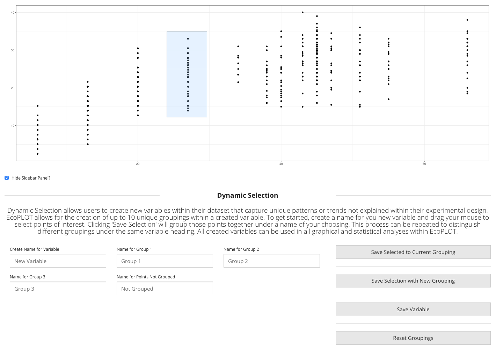

<h1><b> Environmental Data</b></h1>  
The following guide explains how to operate within the Environmental Data module of EcoPLOT. Here we explain the capabilities unique to this module.
  
  
  <h2><b>What is Environmental Data?</b></h2>  
  

  Environmental data includes everything collected over the course of an experiment that measures the physical or chemical properties of an ecosystem. This includes, but is not limited to, <i>in situ</i> measurements capturing atmsopheric conditions (climate), chemical composition, or physical environmental changes over a defined period.  
    
  EcoPLOT is equipped to handle quantitative or qualitative data containing continuous or categorical variables.  

  
  

  
  <h2><b> Formatting Requirements</b></h2>
    
  In order to utilize EcoPLOT's soil stoichiometry and texture tools, it is important that your uploaded data contain the following column headers.  
  <b>NOTE:</b> The first column of your dataset should be reserved for unique sample ID's. For other columns titles, case does not matter. 
  

  

    
  

    
  <h2><b>CNP Ratios </b></h2>  
    
  Stoichiometric ratios, like the **CNP** (carbon, nitrogen, phosphorus) and **NPK** (nitrogen, phosphorus, potassium), are commonly used as indicators of soil health and microbial activity. The availability or absence of these nutrients directly influences plant growth and influences microbial community composition and activity. Understanding what these ratios are in your soil can provide insight into the ecosystem dynamics of your community of study.  
  
  

  
  <h2><b>Interactive Soil Texture Triangle</b></h2>  
  
  A soil's texture is determined by the relative amount of sand, silt, and clay it is composed of. Soil texture can influence fluid dynamics (water storage/drainage) and nutrient retention. Using EcoPLOT's interactive soil texture triangle, users will be able to better understand their soil of study.  
  
  To use the tool, simply enter your soils percentages of sand, silt, and clay and click "submit." A dot will appear at the corresponding location to inform you of your soil's classification. 
  
  

  
  

  

  
  

  
  <H2><b>Interactive Exploration of your Data</H2></b>
  
EcoPLOT allows for the interactive creation of new variables to capture patterns or trends not explained by exisiting variables in your experimental design. This feature, referred to as dynamic selection, is available in <b>scatter</b> and <b>ordination</b> plots found across the three modules. We explain the steps required to use dynamic selection below.  
  
  

  
  <h5> <b>Steps: </b></h5>  
 <ul>
  <li> <b> Step 1: Name your new variable</b> When visualizing your data graphically, it is common to encounter interesting trends or patterns in your data. When one such trend is encountered, enter a name for this new variable and make your first selection. </li> 
  <li> <b> Step 2: Make your first grouping</b> Simply click and drag your mouse over the points you wish to include in your first grouping. You may make additional selections under the same grouping by clicking "Save Selected to Current Grouping." This will append your new selection to the first under the same group name.</li>
  <li> <b> Step 3: Create new groupings</b> Using the same click and drag method, you may create a new grouping of points and assign a unique name to them. EcoPLOT allows for up to 10 unique groupings per created variable. </li>
  <li> <b> Step 4: Name points not grouped</b> The final step in creating your variable is to assign a name for those points not included in any group selection. </li>
  <li> <b> Step 5: Click "Save Variable"</b> Clicking Save Variable will append your newly created variable as a column in your existing dataframe, where it can be accessed in statistical and graphical analyses across each module of EcoPLOT. An example output is included below.</li>
  </ul>
  
  

 
<b> NOTE: </b> There is no limit to the number of variables you can create within EcoPLOT. If the same sample point is selected in two or more groupings, it will be given the name of the group in which it first appears.  
  
  

  
  <h2><b>Citations</b></h2> 
  
Griffiths, B.S., Spilles, A., and Bonkowski, M. (2012). C:N:P stoichiometry and nutrient limitation of the soil microbial biomass in a grazed grassland site under experimental P limitation or excess. Ecological Processes 1, 1–11.
  
  
  