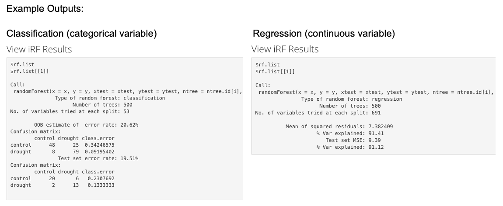

<h1><b> iRF Guide</b></h1>
 This guide provides a step-by-step explanation of the steps required to successfully perform the <b> iterative Random Forest (iRF) </b> algorithm within EcoPLOT. 
  

    
**Note:** iRF is best utilized when Environmental, Phenotypic, and Amplicon datasets are present. It is meant to be used in combination with the other visual and statistical tools found within EcoPLOT. We recommend users get to know their dataset before using iRF so as not to draw conclusions that are not biologically relevant.  
  
<h2><b> Introduction to Machine Learning</h2></b>  
  
Machine learning (ML) is a branch of computing sciences in which algorithms are built to learn, adapt, and uncover patterns present in a dataset, often attempting to predict a target/response variable given its associated features.  
  
While there are multiple variations of machine learning, our focus in EcoPLOT is on **Supervised** learning, where a model uses pre-labeled data to predict the value or class of a response variable. For example, this form of ML can be used to predict plant height given bacterial soil community composition, providing an estimate on a continuous (in units ft, cm, etc...) or a binary scale (tall vs. short).  

<h2><b> Introduction to iRF  </h2></b>  
  
The iterative random forest algorithm (iRF) is a tool that builds off of Random Forests, an exisitng type of ML, to discover high order interactions between abiotic and biotic factors in large, complex datasets. Its application to biological systems has been demsontrated previously in the <i> Drosophila </i> embryo, where iRF returned known and unknown interactions between transcription factors. The application of iRF has the potential to uncover novel relationships between environmental factors present in one's data and is an effective tool for the generation of new hypotheses. 
  
  
<H2> <b>Step 1: Formatting your data for iRF</H2></b>
  
In order to perform iRF it is required that you have uploaded a 16S dataset to the <i> microbiome </i> tab that includes a mapping file. If you have previously uploaded files to the <i> Environment </i> or <i> Phenotype </i> tabs with matching sample ID's to your microbial data, they will be included in this dataset.  
  
Clicking the button, "Prepare Data for iRF," will initiate the creation of this dataset. ML requires that each individual ASV be given its own column with their respective sample abundances in each row. Depending on the size of your dataset this can be a time intensive process.  Due to rendering limitations within Shiny, only columns 1-50 are shown in the table. The entire dataset, however, is available for download.  
  
<h2><b> Step 2: Creation of Test and Train Datasets</h2></b>  
  
Following formatting, the next step is to create the training and testing datasets. For reference, the training dataset is used to create and train the model, whose accuracy is then evaulated against the testing dataset. Common practice is to place 80% of one's data in the training set, however EcoPLOT allows users the ability to specify. EcoPLOT only visualizes columns 1:50 for each created dataset, due to rendering limitations within Shiny. The entire dataset, however, is available for download.  
  
Included in this step is the selection of your output variable and the removal of unnecessary ones. Your output variable is your variable of interest, aka that feature which you eventually want to make a prediction on. This variable can be continuous or a factor variable, iRF recognizes both and will use a classification model for categorical variables and a regression model for continouous ones. It is also important to remove undesired variables from being included in the analysis. These variables are often unique to each individual sample and do not contain any importance in experimental design. Failure to remove these extraneous variables may cause issues in the algorithm's performance.  
    
  
<h2><b> Step 3: Run IRF</h2></b>  
  
We recommend that iRF first be performed using the default parameters. Following a preliminary run, the parameters can be adjusted to better fit the model, although the prediction accuracy and interaction discovery of iRF are robust to parameters. The following parameters can be altered in EcoPLOT: 
  <ul>
  <li> <b> Depth:</b> Represents how maybe splits the tree has, aka how large the tree should be. Increasing depth can capture more information about your data, but it can also lead to overfitting. </li> 
  <li> <b> nchild:</b> How many children should be included in each non-leaf node of the random intersection trees.</li>
  <li> <b> ntree:</b> Refers to the number of trees to use in each iteration of the random forest. After a point, increasing tree number is negligible to improving the model.</li>
  <li> <b> nbootstrap:</b> The number of bootstrap replicates to be used in the calculation of stability scores of discovered interactions. </li>
  </ul>
    <b> Note: </b>Depending on the size of your dataset, iRF can take multiple minutes to run. This is to be expected. Do not repeatedly click the 'Perform iRF' button, this will cause the function to run again immediately after it finishes. A notification will appear on screen while iRF is running. A results table will appear once it has completed.  
    
  

<h2><b> Interpretation of iRF Results</h2></b>  
  
The following image depicts an example output, provided the user has chosen to have iRF search for variable interactions.  

  
  As you can see, the output varies depending on the class of your selected output variable, be it continuous or categorical. Both output types list the number of trees used, give the number of variables used at each split of the tree, and provide an error rate estimation of the model's performance. 
  For the **classification** model, an out of bag error estimate of error (OOB) is provided, which is calculated by counting how many points in the training or testing dataset were miscalculated and diving them by the total number of observations. The OOB error rate provides an estimate to the accuracy of the model. An OOB error rate and confusion matrix is provided for both the training and testing datasets.  
  
  The **regression** output gives three different values. The first, Mean of squared residuals gives the mean of the squared difference between predicted values and actual values in the training dataset, known as residuals. It can be thought of as a measurement of spread of the dependent varaible values. Second % variation explained, also known as R2, is a measure of how well the OOB predictions explain the output variable variance of the testing and training datasets. Lastly, MSE, or mean squared error, gives the average squared difference of the estimated values and the actual values. It is used as an indicator of model predictive quality and values closer to zero signify a stronger model.  
  
  

<h2><b> View iRF Results Graphically </h2></b>  
  
  EcoPLOT provides two graphical representations of the iRF model for users to visualize: 
  <ul>
  <li> <b>Variable Importance Plot:</b> Returns a plot of important variables and their corresponding importance scores as measured by a Random Forest. Importance scores are determined by the mean decrease in Gini importance, a measurement of how a variable contributes to the purity/homogeneity of a node in the forest. The higher the Gini measurement, the more important the variable is in the model.</li>
  <li> <b>Variable Interaction Plot:</b> Returns plot of variable interactions and their corresponding stability scores. Interactions are defined as variables that frequently appear together at splits of a tree in the forest. Variables that exhibit an interaction are listed together, separated by an underscore (_). Increasing the <b> depth </b> parameter can increase iRF's ability to uncover interactions. While statistically interesting, the returned interactions do not necessarily imply biological significance. We encourage users to generate novel hypotheses with their iRF results.</li>
  </ul>  
  
  Raw tables can be viewed and downloaded for both variable importance and variable interaction plots. 
    
<h2><b> Citations </h2></b>

Basu,S. et al. (2018) Iterative random forests to discover predictive and stable high-order interactions. Proc. Natl. Acad. Sci., 115, 1943–1948.
  
Breiman, L. (2001), Random Forests, Machine Learning 45(1), 5-32.

