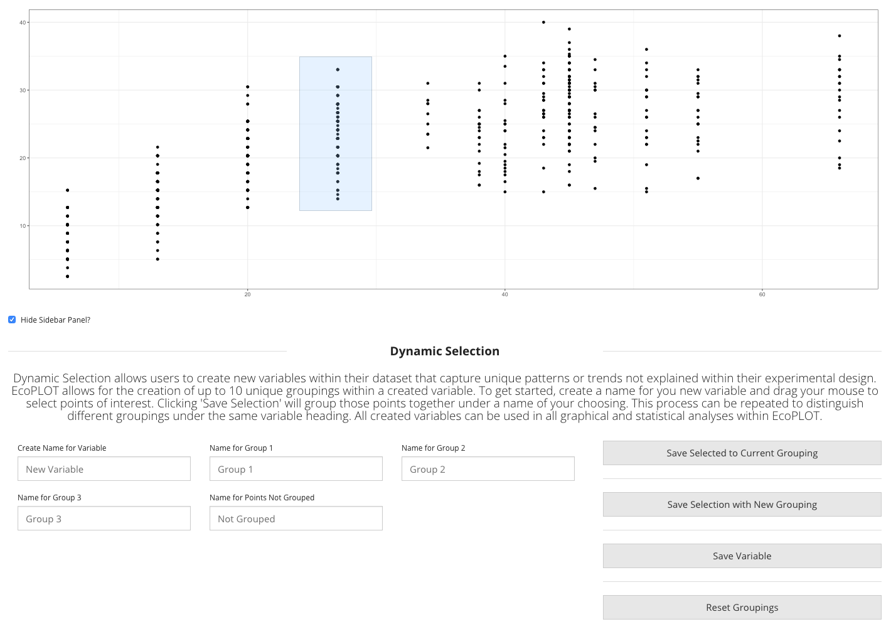
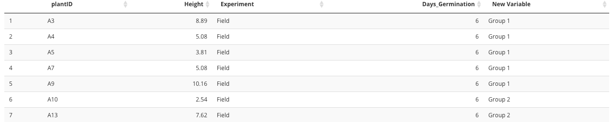

<h1><b> Phenotype Data</b></h1>  
The following guide explains how to operate within the Phenotype Data module of EcoPLOT. Here we explain the capabilities unique to this module.
  
  
  <h2><b>What is Phenotype Data?</b></h2>  
  
  Phenotypic data consists of the qualitative measurements associated with a plant's physical appearance taken across its lifecycle. Some examples of phenotypic data are plant height, count of leaves, color or pigmentation, and number of roots. 

  

<h2><b>Phenotypic Data in EcoPLOT</b></h2>  
  
  The phenotype data module is best utlized when combined with environmental data. If data has already been uploaded to the Environmental module and if that data shares the same sample IDs as those withing your phenotype file, the two will be merged, allowing you to access all experimental variables when creating graphs or performing statistics. The user will be notified if or when the two files are merged successfully. 
  
  

  
  <H2><b>Interactive Exploration of your Data</H2></b>
  
EcoPLOT allows for the interactive creation of new variables to capture patterns or trends not explained by exisiting variables in your experimental design. This feature, referred to as dynamic selection, is available in <b>scatter</b> and <b>ordination</b> plots found across the three modules. We explain the steps required to use dynamic selection below.  
  
  

  
  <h5> <b>Steps: </b></h5>  
 <ul>
  <li> <b> Step 1: Name your new variable</b> When visualizing your data graphically, it is common to encounter interesting trends or patterns in your data. When one such trend is encountered, enter a name for this new variable and make your first selection. </li> 
  <li> <b> Step 2: Make your first grouping</b> Simply click and drag your mouse over the points you wish to include in your first grouping. You may make additional selections under the same grouping by clicking "Save Selected to Current Grouping." This will append your new selection to the first under the same group name.</li>
  <li> <b> Step 3: Create new groupings</b> Using the same click and drag method, you may create a new grouping of points and assign a unique name to them. EcoPLOT allows for up to 10 unique groupings per created variable. </li>
  <li> <b> Step 4: Name points not grouped</b> The final step in creating your variable is to assign a name for those points not included in any group selection. </li>
  <li> <b> Step 5: Click "Save Variable"</b> Clicking Save Variable will append your newly created variable as a column in your existing dataframe, where it can be accessed in statistical and graphical analyses across each module of EcoPLOT. An example output is included below.</li>
  </ul>
  
  

 
<b> NOTE: </b> There is no limit to the number of variables you can create within EcoPLOT. If the same sample point is selected in two or more groupings, it will be given the name of the group in which it first appears.  
  